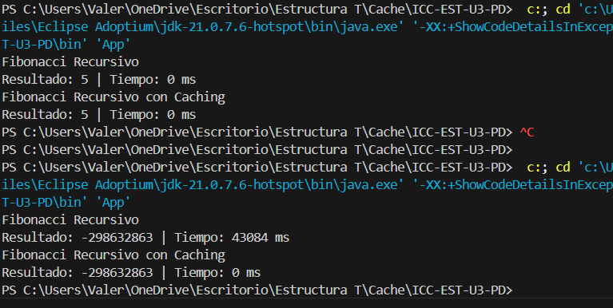
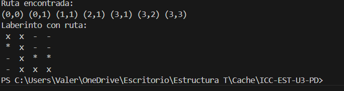

# Maze Path Finder
## 📌 Información General

Asignatura: Estructura de Datos

Carrera: Computación

Estudiante: [Kelly Valeria Guaman Leon]

Fecha: [16/07/2025]

Profesor: Ing. Pablo Torres




# 🧭 Maze Path Finder

Este proyecto implementa un algoritmo de resolución de laberintos en Java utilizando búsqueda recursiva en las cuatro direcciones (arriba, abajo, izquierda, derecha). El laberinto se representa como una matriz booleana y se imprime visualmente mostrando el recorrido encontrado.

## 📌 Características

- Representación del laberinto como matriz `boolean[][]`, donde `true` indica camino y `false` indica muro.
- Búsqueda recursiva para encontrar una ruta desde el punto inicial al final.
- Visualización del laberinto con símbolos:
  - `" - "` para celdas transitables.
  - `" * "` para muros.
  - `" x "` para las celdas que forman parte del camino encontrado.
- Modularidad y separación de responsabilidades entre clases como `Maze`, `MazeSolverRecursive`, `Cell`, y `App`.

## 📂 Estructura de Clases

| Clase                 | Descripción                                                                 |
|----------------------|------------------------------------------------------------------------------|
| `App`                | Punto de entrada. Inicializa el laberinto y ejecuta el resolver.             |
| `Maze`               | Encapsula la matriz y gestiona su impresión en consola.                      |
| `MazeSolverRecursive`| Implementación del algoritmo recursivo que explora en las 4 direcciones.     |
| `Cell`               | Representa una celda con coordenadas `(row, col)` y permite comparar rutas.  |
| `MazeSolver`         | Interfaz para permitir distintas estrategias de resolución.                  |

## 🧠 Algoritmo

Utiliza **búsqueda recursiva DFS (Depth-First Search)**. En cada paso:
- Verifica si la celda es válida.
- Marca celdas visitadas para evitar ciclos.
- Explora las cuatro direcciones.
- Agrega la celda a la ruta si contribuye a llegar al destino.

## 🔧 Cómo ejecutar

1. Compila todos los archivos `.java`.
2. Ejecuta la clase `App`.
3. Se imprimirá la ruta en coordenadas y luego una visualización del laberinto con el camino trazado.

## ✨ Ejemplo de salida

```text
Ruta encontrada:
(0,0) (0,1) (1,1) (2,1) (3,1) (3,2) (3,3) 

Laberinto con ruta:
 x  x  -  - 
 *  x  -  - 
 -  x  *  * 
 -  x  x  x 

